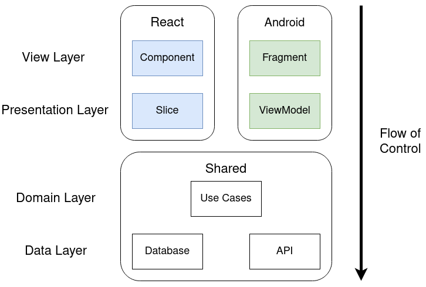
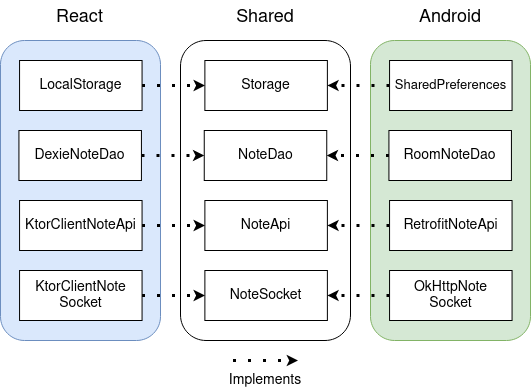
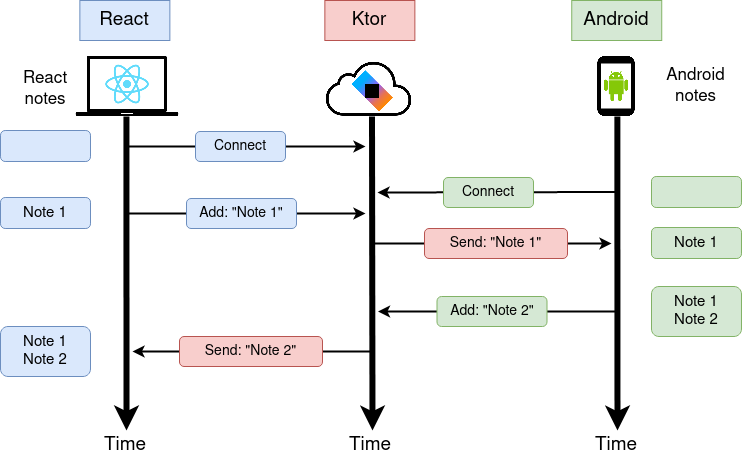
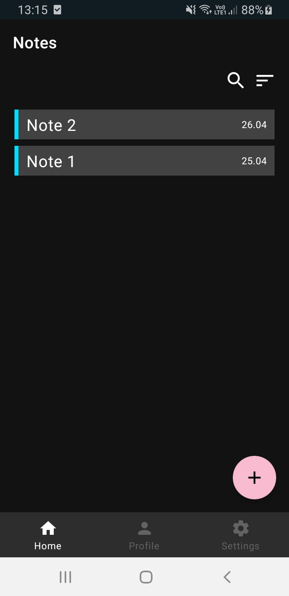
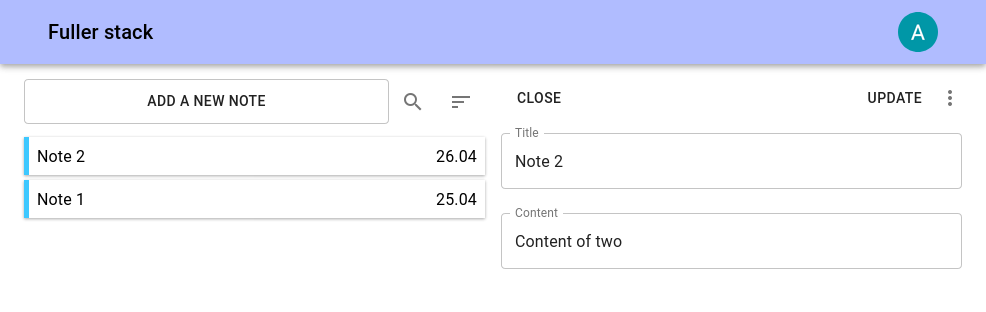

# Fuller stack


<a href="https://androidweekly.net/issues/issue-480">

</a>

A simple note taking app for Android and the Web. Both client platforms share code using Kotlin Multiplatform and use
a Ktor server.

The project is part of my [article series](https://akjaw.com/kotlin-multiplatform-for-android-and-the-web-part-1/) about
Kotlin Multiplatform for Android and the Web.

## The client platform architecture




## How to change the server ip to the local server
The server endpoint can be changed in the [commonMain/network.ApiUrl](shared/src/commonMain/kotlin/network/ApiUrl.kt) 
file.

## Ktor server



The gradle command for running the ktor server:
```
$ ./gradlew :ktor:ktorRun
```
The server will run on port 9000.

Test account email: test@test.com
Test account password: Test123123

## Android app




The gradle command for installing the android app:
```
$ ./gradlew :android:app:installDebug
```

## React app



The gradle command for running the react app:
```
$ ./gradlew :react:spa-app:reactRun
```
The app will run on port 8080
